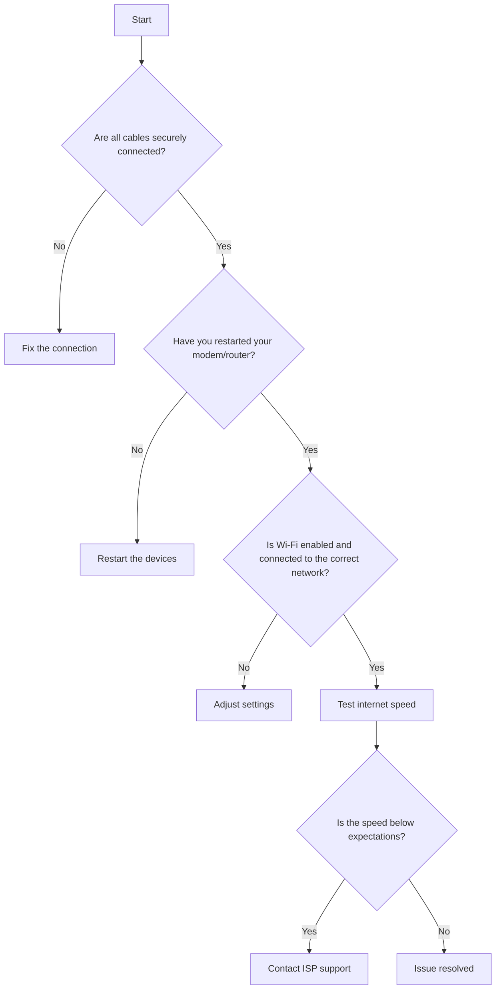

# Guide: Troubleshooting Internet Connection Issues

## 1. Introduction

This guide provides a simple troubleshooting workflow for diagnosing and resolving common internet connection problems. Follow the steps outlined below and refer to the accompanying flowchart for a visual representation of the process.

## 2. Steps

### Step 1: Check Physical Connections

- Ensure your modem and router are plugged in and powered on.

- Verify that all cables are securely connected to the correct ports.

- Check for visible damage to cables.

- Action: If a cable is loose or damaged, secure or replace it. If all connections are fine, proceed to Step 2.

### Step 2: Restart Devices

- Turn off your modem and router.

- Wait for 30 seconds, then turn them back on.

- Restart your computer or device.

- Action: If the issue persists after restarting, move to Step 3.

### Step 3: Verify Network Settings

- Ensure Wi-Fi is enabled on your device.

- Confirm that you’re connected to the correct network.

- Check for error messages or limited connectivity warnings.

- Action: Adjust settings or re-enter the Wi-Fi password if necessary. If no issues are found, continue to Step 4.

### Step 4: Test Internet Speed

- Use an online speed test tool to check your connection speed.

- Compare the results with your internet plan.

- Action: If speeds are significantly lower than expected, contact your Internet Service Provider (ISP). Otherwise, proceed to Step 5.

### Step 5: Contact ISP Support

- Call or chat with your ISP to report the issue.

- Provide details about the troubleshooting steps you’ve already taken.

- Action: Follow their instructions or schedule a technician visit if necessary.

## 3. Flowchart

## 4. Conclusion

By following this guide and using the flowchart, most common internet connection issues can be quickly diagnosed and resolved. For persistent problems, contacting your ISP is recommended.

